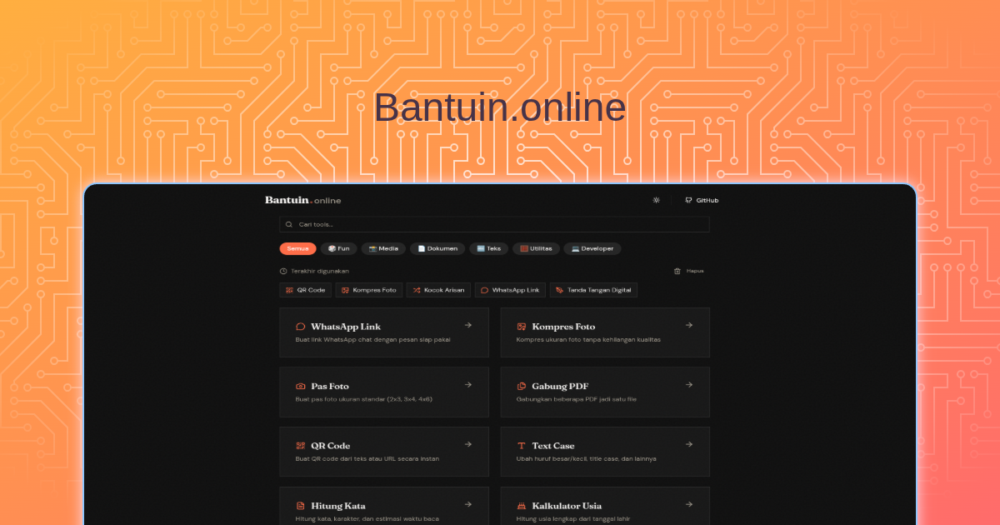

# Bantuin.online



**Kumpulan tools gratis untuk kebutuhan harianmu.**
Kompres foto, buat pas foto, gabung PDF, dan berbagai alat bantu lainnya dalam satu aplikasi web yang ringan dan cepat.

## Fitur

- **Image Tools**: Kompres gambar, resize, dan konversi format.
- **PDF Tools**: Gabungkan file PDF (Merge PDF).
- **Utility Tools**: QR Code Generator, dan lainnya.
- **PWA Support**: Bisa diinstall sebagai aplikasi di HP/Desktop dan berjalan offline.
- **Privacy First**: Proses file dilakukan di browser (client-side), file Anda tidak dikirim ke server.

## Tech Stack

- [React](https://react.dev/)
- [Vite](https://vitejs.dev/)
- [Tailwind CSS](https://tailwindcss.com/)
- [Shadcn UI](https://ui.shadcn.com/)
- [Vite PWA](https://vite-pwa-org.netlify.app/)

## Instalasi

1.  Clone repository ini:

    ```bash
    git clone https://github.com/odnmalau/bantuin.online.git
    ```

2.  Masuk ke direktori project:

    ```bash
    cd bantuin.online
    ```

3.  Install dependencies:

    ```bash
    bun i
    ```

4.  Jalankan development server:
    ```bash
    bun run dev
    ```

## Lisensi

Project ini dilisensikan di bawah lisensi [MIT](LICENSE).
